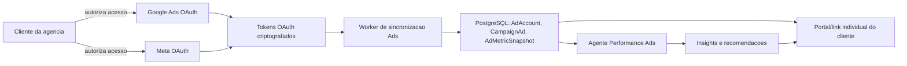
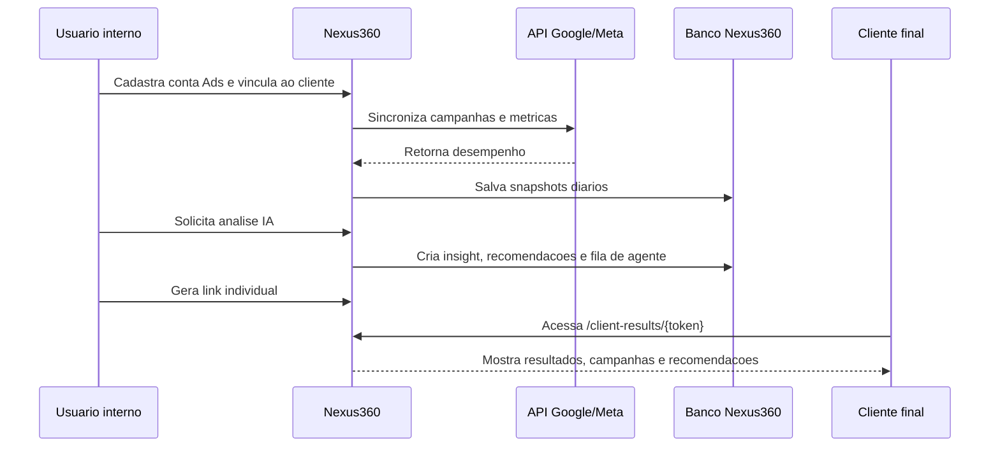
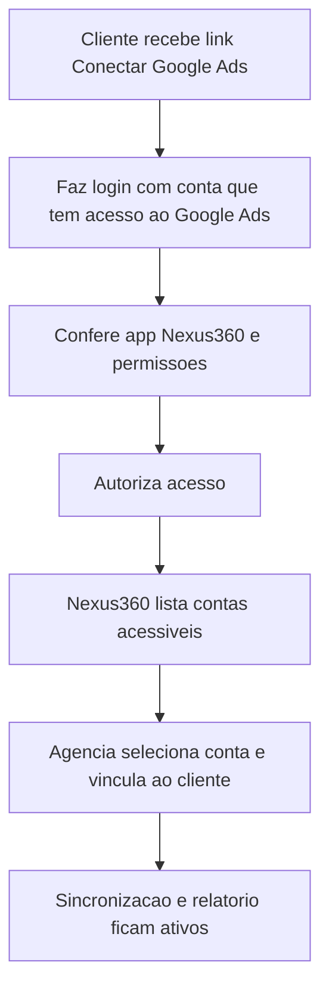
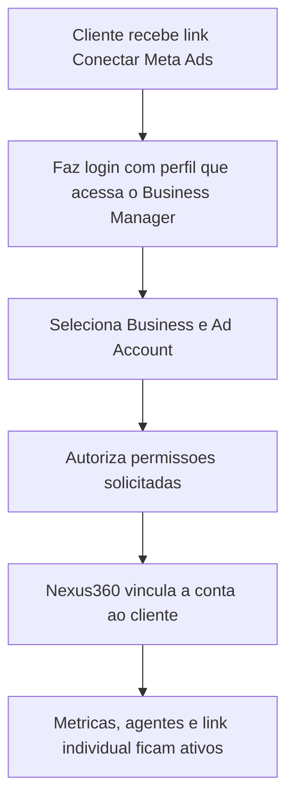

# Nexus360 Ads: guia de integracao Google Ads e Meta Ads

Atualizado em 10/06/2026.

Este guia documenta o fluxo para conectar Google Ads e Meta Ads ao Nexus360, configurar URLs exigidas pelas plataformas, orientar clientes e preparar revisao de aplicativo.

## 1. URLs oficiais do Nexus360

Use `APP_URL` como dominio publico da instalacao. Em producao padrao:

```text
APP_URL=https://nexus360.consultio.com.br
```

Para white-label, substitua por `https://crm.seudominio.com.br`.

### URLs publicas obrigatorias

| Uso | URL padrao | Observacao |
| --- | --- | --- |
| Pagina inicial | `https://nexus360.consultio.com.br` | Home/app principal. |
| Politica de privacidade | `https://nexus360.consultio.com.br/legal/privacy` | Obrigatoria para Google OAuth e Meta App. |
| Termos de uso | `https://nexus360.consultio.com.br/legal/terms` | Recomendada/solicitada em revisoes e apps comerciais. |
| Exclusao de dados | `https://nexus360.consultio.com.br/legal/data-deletion` | Usada pela Meta para instrucoes de exclusao de dados. |
| Relatorio individual do cliente | `https://nexus360.consultio.com.br/client-results/{token}` | Gerado no modulo Trafego (Ads). |

### URLs tecnicas de OAuth planejadas

O modulo atual ja tem banco, relatorios, snapshots e agentes. Para OAuth real, reservar estas URLs:

| Plataforma | URL |
| --- | --- |
| Google Ads redirect URI | `{APP_URL}/api/ads/oauth/google/callback` |
| Meta Ads redirect URI | `{APP_URL}/api/ads/oauth/meta/callback` |
| Google OAuth start | `{APP_URL}/api/ads/oauth/google/start` |
| Meta OAuth start | `{APP_URL}/api/ads/oauth/meta/start` |

Antes de habilitar OAuth real, implementar estes endpoints no backend com `state` assinado, troca de `code` por token e criptografia dos tokens.

## 2. Arquitetura da integracao



## 3. Fluxo operacional no Nexus360



## 4. Dados coletados

### Google Ads

Coletar somente o necessario para relatorio e recomendacao:

- conta e nome da conta;
- campanhas, grupos de anuncios e anuncios;
- status, objetivo, orcamento e moeda;
- impressoes, cliques, custo, CTR, CPC, CPM;
- conversoes, valor de conversao, CPA e ROAS;
- periodo de coleta e identificadores externos.

### Meta Ads

Coletar somente o necessario:

- ad account e business associado quando disponivel;
- campanhas, conjuntos de anuncios, anuncios e criativos;
- status, objetivo, orcamento e moeda;
- impressions, clicks, spend, ctr, cpc, cpm;
- actions/conversions, cost per action e purchase/conversion value quando disponivel.

## 5. Configuracao Google Ads

### 5.1 Criar projeto no Google Cloud

1. Acesse Google Cloud Console.
2. Crie ou selecione um projeto da agencia.
3. Configure a tela de consentimento OAuth.
4. Adicione nome do app, email de suporte, dominio autorizado e URLs publicas.
5. Crie credenciais OAuth do tipo Web application.
6. Cadastre a redirect URI:

```text
https://nexus360.consultio.com.br/api/ads/oauth/google/callback
```

Para white-label:

```text
https://crm.seudominio.com.br/api/ads/oauth/google/callback
```

### 5.2 URLs para tela de consentimento Google

| Campo Google | Valor |
| --- | --- |
| App homepage | `{APP_URL}` |
| Privacy Policy URL | `{APP_URL}/legal/privacy` |
| Terms of Service URL | `{APP_URL}/legal/terms` |
| Authorized domain | dominio sem protocolo, ex: `nexus360.consultio.com.br` |
| Authorized redirect URI | `{APP_URL}/api/ads/oauth/google/callback` |

### 5.3 Escopos Google

Escopo minimo para Google Ads API:

```text
https://www.googleapis.com/auth/adwords
```

O Google Ads API usa OAuth 2.0 para acessar dados em nome do usuario e requer configuracao no Google API Console. Consulte as referencias oficiais no fim do documento.

### 5.4 Developer token

Alem do OAuth Client ID/Secret, a integracao precisa de:

```text
GOOGLE_ADS_DEVELOPER_TOKEN=
GOOGLE_ADS_CLIENT_ID=
GOOGLE_ADS_CLIENT_SECRET=
GOOGLE_ADS_LOGIN_CUSTOMER_ID=
```

`LOGIN_CUSTOMER_ID` e necessario quando a agencia usa uma MCC/conta administradora.

## 6. Configuracao Meta Ads

### 6.1 Criar app Meta

1. Acesse Meta for Developers.
2. Crie um app para a empresa/agencia.
3. Configure Basic Settings.
4. Preencha dominio do app, URL de privacidade, termos e exclusao de dados.
5. Adicione Facebook Login for Business ou produto equivalente recomendado pela Meta no momento da criacao.
6. Adicione Marketing API.
7. Configure redirect URI.

```text
https://nexus360.consultio.com.br/api/ads/oauth/meta/callback
```

Para white-label:

```text
https://crm.seudominio.com.br/api/ads/oauth/meta/callback
```

### 6.2 URLs para Basic Settings da Meta

| Campo Meta | Valor |
| --- | --- |
| App Domains | `nexus360.consultio.com.br` |
| Privacy Policy URL | `{APP_URL}/legal/privacy` |
| Terms of Service URL | `{APP_URL}/legal/terms` |
| User Data Deletion | `{APP_URL}/legal/data-deletion` |
| OAuth Valid Redirect URI | `{APP_URL}/api/ads/oauth/meta/callback` |
| Site URL | `{APP_URL}` |

### 6.3 Permissoes Meta

Para leitura e relatorio:

```text
ads_read
business_management
```

Para alterar campanhas, pausar, editar verba ou aplicar recomendacoes:

```text
ads_management
```

Recomendacao: iniciar em modo leitura com `ads_read`. Liberar `ads_management` apenas quando houver aprovacao humana dentro do Nexus360 e revisao adequada na Meta.

## 7. Checklist para o cliente autorizar

### Google Ads



Orientacao para o cliente:

1. Use a conta Google que tem acesso administrativo ou leitura na conta de anuncios.
2. Autorize o Nexus360 a consultar dados de campanha.
3. Nao compartilhe senha. A conexao ocorre por OAuth.
4. O acesso pode ser revogado a qualquer momento na conta Google.

### Meta Ads



Orientacao para o cliente:

1. Use o perfil que tem acesso ao Business Manager e a conta de anuncios.
2. Selecione a empresa e a conta correta.
3. Autorize o acesso de leitura para relatorios.
4. Para permitir alteracoes de campanha, a agencia deve solicitar permissao adicional.

## 8. Checklist interno antes de enviar para revisao

- [ ] `APP_URL` configurado com HTTPS publico.
- [ ] `FRONTEND_URL` configurado com HTTPS publico.
- [ ] Paginas publicas abrem sem login:
  - [ ] `/legal/privacy`
  - [ ] `/legal/terms`
  - [ ] `/legal/data-deletion`
- [ ] Redirect URIs cadastradas exatamente iguais nas plataformas.
- [ ] Tokens OAuth serao criptografados antes de salvar.
- [ ] `state` OAuth assinado com expiracao curta.
- [ ] Logs nao imprimem access token nem refresh token.
- [ ] Cliente consegue revogar/desconectar conta Ads.
- [ ] Link `/client-results/{token}` mostra somente dados daquele cliente.
- [ ] Agente de Ads cria recomendacoes como sugestao, nao aplica alteracoes automaticamente.
- [ ] Para `ads_management`, existe tela de aprovacao humana.

## 9. Variaveis de ambiente recomendadas

```text
APP_URL=https://nexus360.consultio.com.br
FRONTEND_URL=https://nexus360.consultio.com.br

GOOGLE_ADS_DEVELOPER_TOKEN=
GOOGLE_ADS_CLIENT_ID=
GOOGLE_ADS_CLIENT_SECRET=
GOOGLE_ADS_LOGIN_CUSTOMER_ID=

META_APP_ID=
META_APP_SECRET=
META_API_VERSION=v23.0

ADS_TOKEN_ENCRYPTION_KEY=
ADS_SYNC_INTERVAL_MINUTES=30
```

## 10. O que ja existe no codigo

- Modelos: `AdAccount`, `CampaignAd`, `AdMetricSnapshot`, `AdsInsight`, `AdsRecommendation`, `ClientReportShare`.
- Backend: `backend/src/services/adsIntelligence.ts`.
- Rotas protegidas: `/api/ads/ad-accounts`, `/api/ads/ad-accounts/:id/sync`, `/api/ads/clients/:clientId/analyze`, `/api/ads/clients/:clientId/share`.
- Rota publica de relatorio: `/api/client-portal/reports/:token`.
- Frontend publico: `/client-results/:token`.
- Paginas legais publicas: `/legal/privacy`, `/legal/terms`, `/legal/data-deletion`.

## 11. Proxima etapa tecnica

Implementar OAuth real nos endpoints reservados:

```text
GET /api/ads/oauth/google/start
GET /api/ads/oauth/google/callback
GET /api/ads/oauth/meta/start
GET /api/ads/oauth/meta/callback
```

Fluxo tecnico:

1. Usuario interno seleciona cliente.
2. Backend cria `state` assinado contendo `organizationId`, `clientId`, `platform` e expiracao.
3. Usuario e redirecionado para Google/Meta.
4. Callback recebe `code` e `state`.
5. Backend valida `state`.
6. Backend troca `code` por tokens.
7. Tokens sao criptografados e salvos em `AdAccount`.
8. Worker executa primeira sincronizacao.

## 12. Referencias oficiais

- Google Ads API OAuth overview: https://developers.google.com/google-ads/api/docs/oauth/overview
- Google Ads API Google Cloud project setup: https://developers.google.com/google-ads/api/docs/oauth/cloud-project
- Google Cloud OAuth app branding: https://support.google.com/cloud/answer/15549049
- Meta App Basic Settings: https://developers.facebook.com/docs/development/create-an-app/app-dashboard/basic-settings/
- Meta App Review permissions: https://developers.facebook.com/docs/apps/review/permissions/
- Meta Marketing API authorization: https://developers.facebook.com/docs/marketing-api/overview/authorization/
